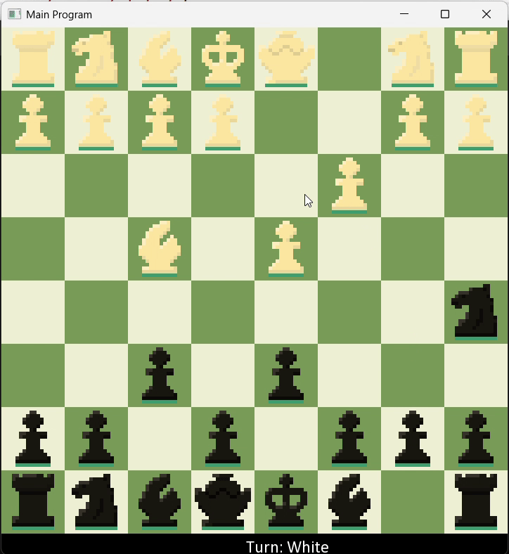

# ChessApp

A minimal chess demo built in C++17 using SFML.  
Supports move validation, piece‐capture, board rendering, and basic event handling.

  

I developed this app for vaildating my understanding of Object oriented programming, ownership of objects and memory management, Event loop manangement.
I also decided to implement a small state machine (3-states) for virtualizing a move, but it was handled in the event loop itself.

Instructions:
Use left-click to choose a piece. Use left-click again on the same box again to drop back or another valid box to make a move.

---

## Table of Contents

- [Features](#features)  
- [Prerequisites](#prerequisites)  
- [Building](#building)  
  - [Visual Studio (native)](#visual-studio-native)  

## Features

- Full 8×8 board rendering with alternating square colors  
- Move legality checks and turn management  
- Sprite-based piece rendering & capture handling  
- Keyboard & mouse event loop with 60 FPS cap  

---

## Prerequisites

- **C++17** compiler (MSVC 2019+, GCC 9+, Clang 10+)  
- **SFML 2.5.x** (graphics · window · system)  
- **CMake ≥ 3.10** (if you use the CMake workflow)  
- **Git** (for cloning & submodule management)

---
## Building
Make sure to include the SFML directory and its corresponding linkers
This my Visual Studio configuration-
 Additional Include directories:
"path_to\SFML-2.5.1-windows-vc15-64-bit\SFML-2.5.1\include";

 Additional Library directories:
"path_to\SFML-2.5.1-windows-vc15-64-bit\SFML-2.5.1\lib";

Linkers:
sfml-graphics-s.lib;
sfml-window-s.lib;
sfml-system-s.lib;
sfml-main-d.lib;
opengl32.lib;
freetype.lib;
winmm.lib;

Similar structure can be followed for CMake.

## Future Goals
1) Adding a tutorial mode:
  This shows the feasible boxes available to move for every piece, in a highlighted color. This is designed to help beginners.
2) Adding a state machine to track various stages of check
This will contain 3 stages-
  safe --> check --> check-mate(game over)
